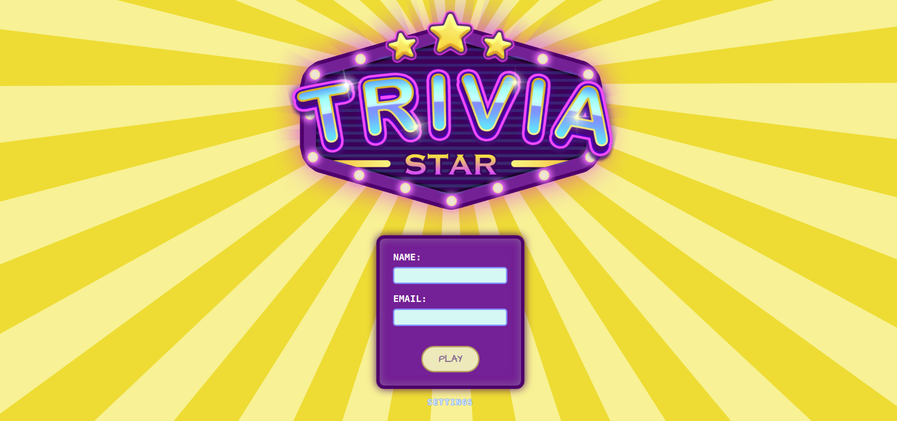

<h1 align="center" id="welcome">Welcome to the Trivia project repository!</h1>


>Project developed in the Front-End module of <a href="https://www.betrybe.com/">Trybe's</a> Web Development course.

<div align="center">
  <a href="#about">About</a>
  <span> | </span>  
   <a href="#technologies">Technologies</a>
  <span> | </span>  
   <a href="#features">Features</a>
  <span> | </span>  
   <a href="#APIs">APIs</a>
  <span> | </span>
  <a href="#prerequisites">Prerequisites</a>
  <span> | </span>  
   <a href="#installation">Installation</a>
  <span> | </span>  
  <a href="#team">Team</a>
  <span> | </span>  
  <a href="#license">License</a>  
</div>

<h1 id="about">💬 About</h1>
<p>In this project a quiz game based on the Trivia game was developed. The work was carried out in group, using agile methodologies, seeking to create an environment similar to the labor market. In this app you will choose between multiple choice or true or false questions, you can also choose the theme and the number of questions to be answered.</p>

<h1 id="technologies">:rocket: Technologies</h1>

- [React](https://reactjs.org)
- [Redux](https://redux.js.org/)

<h1 id="features">🛠️ Features</h1>

- [X] Log in to the game and, if the email is registered on the [Gravatar](https://pt.gravatar.com/) website, have your photo associated with the user's profile;
- [X] Access the game page, where you must choose one of the answers available for each of the questions presented;
- [X] The answer must be marked within 30 seconds;
- [X] Wrong or unanswered answers do not score points;
- [X] At the end, you will be directed to the score screen, where the text shown depends on the number of correct answers;
- [X] View the ranking page, if you like, at the end of each game;
- [X] Allow game setup.

<h1 id="APIs">☁️ APIs</h1>

- [Trivia](https://opentdb.com/api_config.php)
- [Gravatar](https://br.gravatar.com/site/implement/images/)

<h1 id="prerequisites">💻 Prerequisites</h1>

- [Node.js](https://nodejs.org/en/download/)
- [Git](https://git-scm.com/downloads)

<h1 id="installation">📋 Installation</h1>

To install Trivia, follow these steps:

- Linux and macOS:

```
# Step 1: Clone the repository
$ git clone https://github.com/SamuelSilvaMelo/trivia-react-redux.git

# Step 2: Enter the repository folder you just cloned:
$ cd trivia-react-redux

# Step 3: Install dependencies:
$ npm install

# Step 4: Start the project:
$ npm start 

# Step 5: A new page should open in your browser automatically.
```

<h1 id="team">🤝 Team</h1>

We thank the following people who contributed to this project:

<table>
  <tr>
    <td align="center">
      <a href="https://github.com/laissimenikim">
        <br>
        <sub>
          <a href="https://github.com/laissimenikim">Lais Simenikim</a>
        </sub>
      </a>
    </td>
    <td align="center">
      <a href="https://github.com/Marc-Web">
        <br>
        <sub>
          <a href="https://github.com/Marc-Web">Marconi Moreira</a>
        </sub>
      </a>
    </td>
    <td align="center">
      <a href="https://github.com/NataliaSRiber">
        <br>
        <sub>
          <a href="https://github.com/NataliaSRiber">Natalia de Souza</a>
        </sub>
      </a>
    </td>
    <td align="center">
      <a href="https://github.com/SamuelSilvaMelo">
        <br>
        <sub>
          <a href="https://github.com/SamuelSilvaMelo">Samuel Melo</a>
        </sub>
      </a>
    </td>
  </tr>
</table>

<h1 id="license">📝 License</h1>

All rights reserved to [Trybe](https://www.betrybe.com/)

<a href="#welcome">⬆ Scroll To Top</a>
